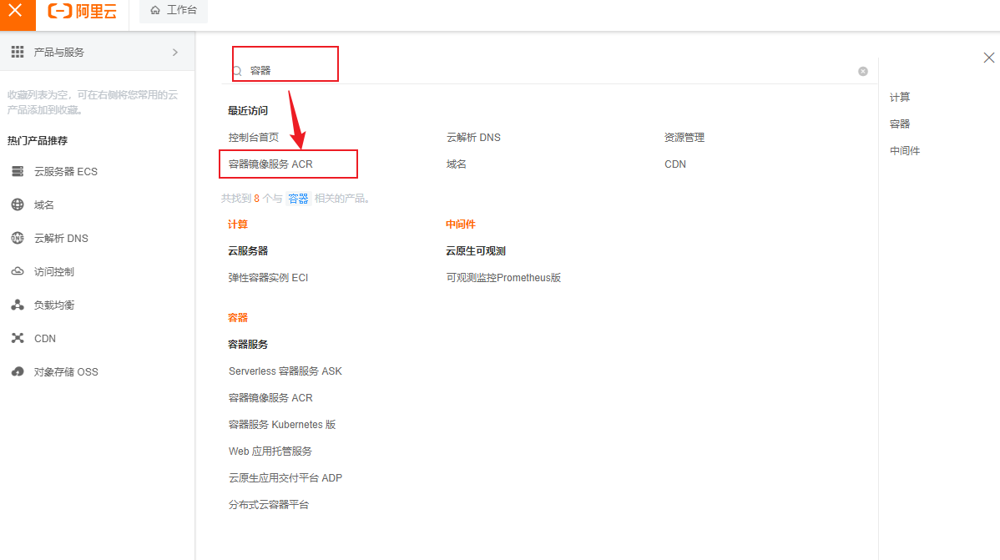
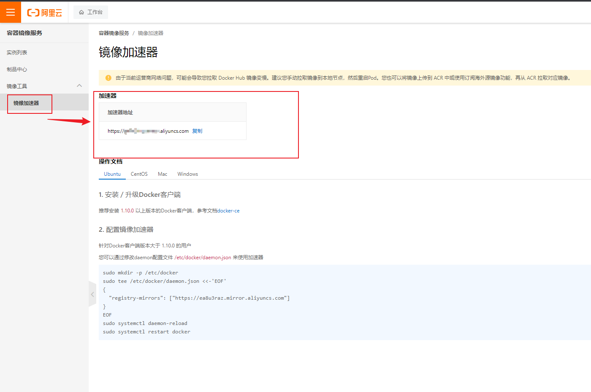
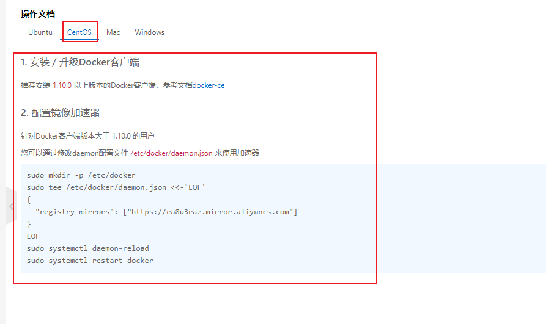

:::tip
  Docker安装的一些前置工作和安装命令
:::
<!-- more -->

### 官网地址

<https://docs.docker.com/engine/install/centos/>

### 1. 安装前的准备

#### 1.1 删除历史版本

```shell
sudo yum remove docker \
                  docker-client \
                  docker-client-latest \
                  docker-common \
                  docker-latest \
                  docker-latest-logrotate \
                  docker-logrotate \
                  docker-engine
```

#### 1.2  安装`yum-utils`已经配置`yum`源

```shell
sudo yum install -y yum-utils
# sudo yum-config-manager --add-repo https://download.docker.com/linux/centos/docker-ce.repo
注意： 上面的yum源是官方的，由于服务器在境外，所以网速很忙，国内的话，试用阿里云的源就可以了，如下：
sudo yum-config-manager --add-repo http://mirrors.aliyun.com/docker-ce/linux/centos/docker-ce.repo
```

#### 1.3 安装依赖

```shell
yum install gcc && gcc-c++
```


### 2. 安装Docker

#### 2.1 执行安装yum命令

```shell
sudo yum install docker-ce docker-ce-cli containerd.io docker-buildx-plugin docker-compose-plugin
```

#### 2.2 启动docker

```shell
sudo systemctl start docker
```

#### 2.3 运行`hello-world`

```shell
sudo docker run hello-world
```

#### 2.4 查看版本

```shell
docker version
```

### 3. 配置阿里镜像





