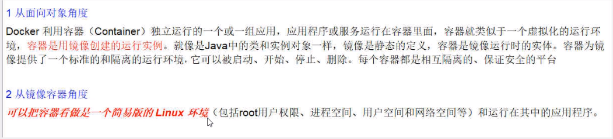
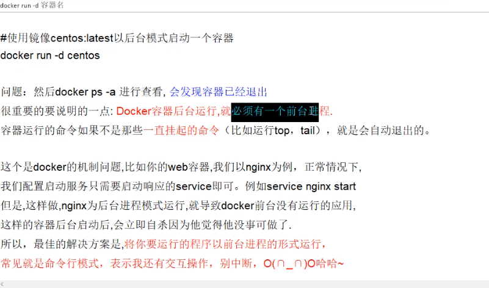
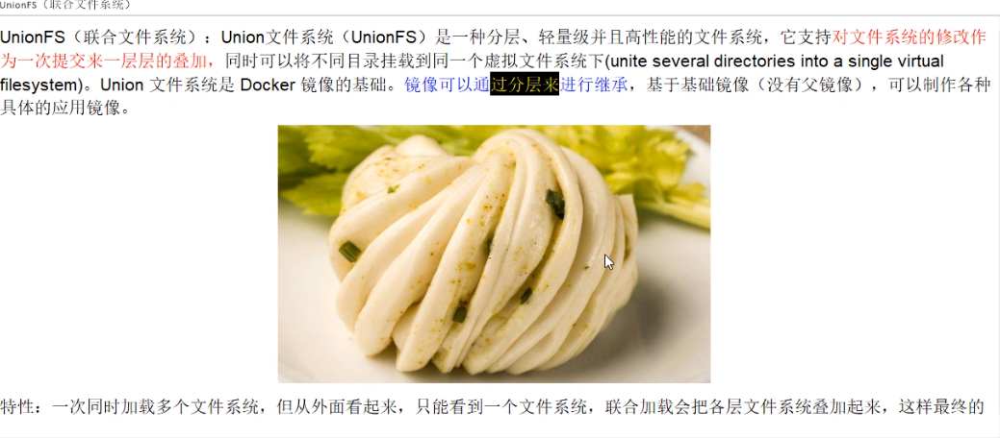
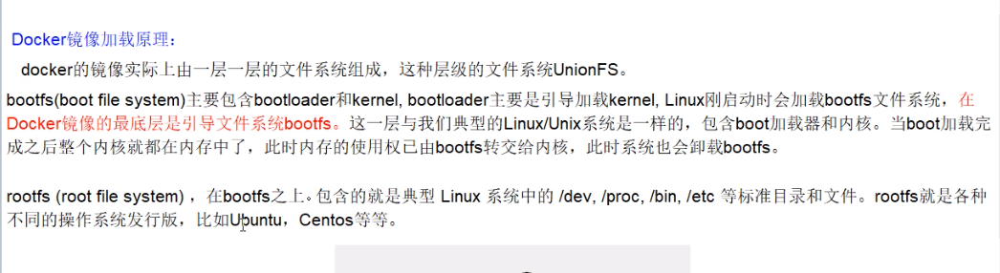
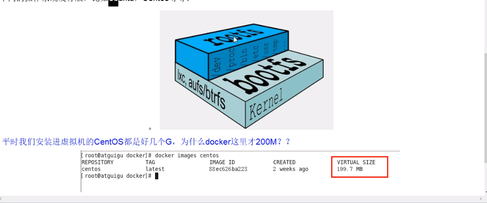
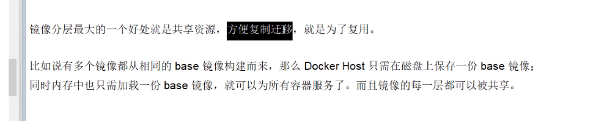
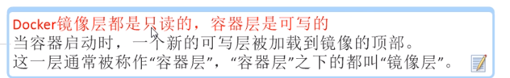
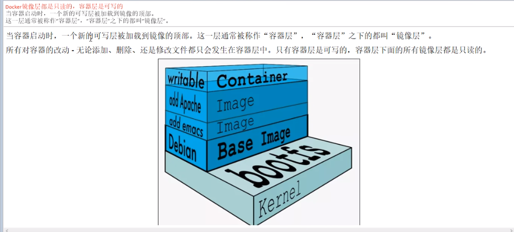

:::tip

   Docker-容器命令，操作容器的一些命令

:::

<!-- more -->




### 1. 新建+运行容器

```shell
[root@localhost ~]docker run [OPTIONS] [容器名称/容器名称:TAG/容器ID] [COMMAND] [ARG...]
[OPTIONS]
--name=容器名称 为容器指定一个名字
-d 后台云信容器并返回容器ID，也即启动守护式容器（后台运行）
-i 以交互模式运行容器，通常有-t同时使用
-t 为容器重新分配一个伪输入终端，通常与-i同时使用，也即启动交互式容器
-P 随机端口映射，大写P
-p 指定端口映射，小写p

[示例]
[root@localhost ~]docker run -it ubuntu /bin/bash
[root@localhost ~]docker run -it  --name=myubuntu ubuntu /bin/bash
/bin/bash: 放在镜像名后的是命令,这里我们希望有个交互式 Shell，因此用的是 /bin/bash。要退出终端，直接输入 exit:
```

小写p参数详解

| 参数                          | 说明                              |
| :---------------------------- | --------------------------------- |
| -p hostPort:containerPort     | 端口映射 -p 8080:80               |
| -p ip:hostPort:containerPort  | 配置监听地址-p 10.0.0.100:8080:80 |
| -pip::containerPort           | 随机分配端口-p 10.0.0.100::80     |
| -p hostPort:containerPort:udp | 指定协议-p 8080:80:tcp            |
| -p 81:80 -p 443:443           | 指定多个                          |

###  2. 列出所有容器

```shell
[root@localhost ~]docker ps [OPTIONS]
[OPTIONS]
-a 列出当前所有正在运行的容器+历史上运行的
-l 显示最近创建的容器
-n 显示最近n个创建的容器
-q 静默模式，只显示容器编号
```

### 3. 退出容器

- exit

  使用 exit 退出，容器停止

- 快捷键

  `ctrl+p+q`,使用快捷键退出，容器不停止

### 4. 启动已停止运行的容器

```shell
[root@localhost ~]docker start 容器ID或者容器名
```

### 5. 重启容器

```shell
[root@localhost ~]docker restart 容器ID或者容器名
```

### 6. 停止容器

```shell
[root@localhost ~]docker stop 容器ID或者容器名
```

### 7. 强制停止容器

```shell
[root@localhost ~]docker kill 容器ID或者容器名
```

### 8. 删除已停止的容器

```shell
[root@localhost ~]docker rm 容器ID或者容器名称
```

### 9. 强制删除容器（未停止的容器）

```shell
[root@localhost ~] docker rm -f 容器ID或者容器名称
```

### 10. 一次性删除多个容器实例

```shell
[root@localhost ~]docker rm -f $(docker ps -a -q)
[root@localhost ~]docker ps -a -q | xargs docker rm
```

### 11. 前台和后台启动

- 前台交互式启动

  ```shell
  [root@localhost ~]docker run -d ubuntu
  ```

  

- 后台守护式启动

  ```shell
  [root@localhost ~]docker run -d ubuntu
  # 这样启动会导致启动失败，具体请了解下图
  [root@localhost ~]docker run -it ubuntu /bin/bash
  # 这样启动就OK
  ```

  



### 12. 查看容器日志

```shell
[root@localhost ~]docker logs 容器ID
```

### 13. 查看容器内运行的进程

```shell
[root@localhost ~]docker top 容器ID
```

### 14. 查看容器的内部细节

```shell
[root@localhost ~]docker inspect 容器ID
```

### 15. 进入正在运行的容器并以命令行交互

- docker exec -it 容器ID bashShell

  ```shell
  [root@localhost /]# docker exec --help
  
  Usage:  docker exec [OPTIONS] CONTAINER COMMAND [ARG...]
  
  Execute a command in a running container
  
  Aliases:
    docker container exec, docker exec
  
  Options:
    -d, --detach               Detached mode: run command in the background
        --detach-keys string   Override the key sequence for detaching a container
    -e, --env list             Set environment variables
        --env-file list        Read in a file of environment variables
    -i, --interactive          Keep STDIN open even if not attached
        --privileged           Give extended privileges to the command
    -t, --tty                  Allocate a pseudo-TTY
    -u, --user string          Username or UID (format: "<name|uid>[:<group|gid>]")
    -w, --workdir string       Working directory inside the container
  
  eg:
  [root@localhost /]# docker exec -it bcf01f555d60 /bin/bash
  root@bcf01f555d60:/# ll 
  ```

  说明：`exec`是在容器中打开新的终端，并且可以启动新的进程用exit退出，不会导致容器停止

- docker attach 容器ID

  ```shell
  [root@localhost /]# docker attach bcf01f555d60
  root@bcf01f555d60:/# exit
  exit
  ```

   说明：`attach`直接进入容器启动命令的终端，不会启动新的进程，用exit退出，会导致容器的停止  

### 16. 从容器拷贝文件到主机

```shell
[root@localhost /] docker cp 容器ID:容器内的路径 目标主机的路径

[root@localhost /]# docker cp bcf01f555d60:/tmp/laoma.txt /laoma
Successfully copied 1.54kB to /laoma
[root@localhost /]# cd laoma/
[root@localhost laoma]# ll
总用量 0
-rw-r--r--. 1 root root 0 6月  27 16:22 laoma.txt
```

### 17. 导入和导出容器

- export 导出容器

  ```shell
  docker export 容器ID >  abcd.tar
  
  [root@localhost laoma]# docker export bcf01f555d60 > ubuntu_01.tar
  [root@localhost laoma]# ll
  总用量 73400
  -rw-r--r--. 1 root root        0 6月  27 16:22 laoma.txt
  -rw-r--r--. 1 root root 75159040 6月  27 16:29 ubuntu_01.tar
  
  ```

- import 导入镜像

  ```shell
  [root@localhost ~]cat 文件名.tar | docker import - 镜像用户/镜像名:版本号
  
  [root@localhost laoma]# cat ubuntu_01.tar | docker import - itmahy/ubuntu:1.0
  sha256:b1393a1efe8273e62bcec62f21b694e44566a7efcc39ef15e63285068509b241
  [root@localhost laoma]# docker images
  REPOSITORY      TAG       IMAGE ID       CREATED         SIZE
  itmahy/ubuntu   1.0       b1393a1efe82   9 seconds ago   72.8MB
  redis           latest    7614ae9453d1   18 months ago   113MB
  ubuntu          latest    ba6acccedd29   20 months ago   72.8MB
  redis           6.0.8     16ecd2772934   2 years ago     104MB
  
  [root@localhost laoma]# docker run -it itmahy/ubuntu:1.0 /bin/bash
  root@454737d833e1:/# [root@localhost laoma]# docker ps
  CONTAINER ID   IMAGE               COMMAND                   CREATED          STATUS          PORTS      NAMES
  454737d833e1   itmahy/ubuntu:1.0   "/bin/bash"               18 seconds ago   Up 18 seconds              upbeat_cerf
  53d9b032b518   redis               "docker-entrypoint.s…"   44 minutes ago   Up 44 minutes   6379/tcp   objective_wright
  
  ```

  

### 18. 镜像分层







- 为什么镜像采用分层结构



- 重点

  

  

### 19. commit命令

命令的作用是：提交容器副本使之成为一个新的镜像

`docker commit -m="提交的描述信息" -a="作者" 容器ID  要创建的目标镜像名:[标签名（版本号）]`

```shell
[root@localhost /]# docker commit -m="install vim tool" -a="itmahy" 454737d833e1 itmahy/ubuntu:1.1
sha256:c2581804e19230cc2f8184762ef6d314daae9e6e09a78e460502234e71900b35
[root@localhost /]# docker images
REPOSITORY      TAG       IMAGE ID       CREATED          SIZE
itmahy/ubuntu   1.1       c2581804e192   4 seconds ago    185MB
itmahy/ubuntu   1.0       b1393a1efe82   38 minutes ago   72.8MB
redis           latest    7614ae9453d1   18 months ago    113MB
ubuntu          latest    ba6acccedd29   20 months ago    72.8MB
redis           6.0.8     16ecd2772934   2 years ago      104MB
```

