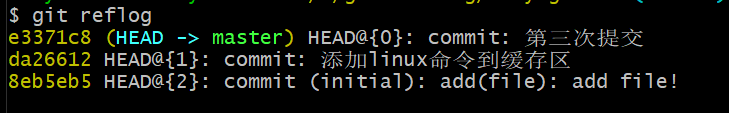
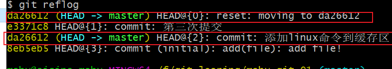
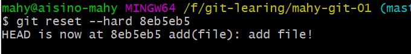
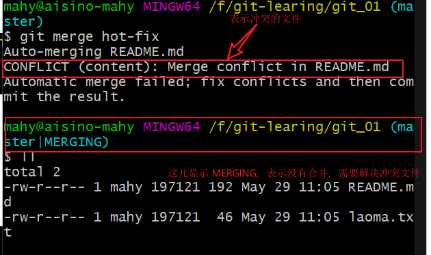
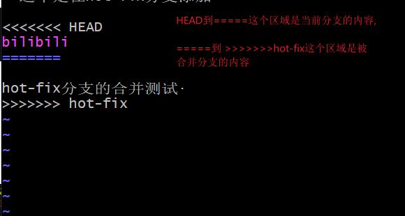
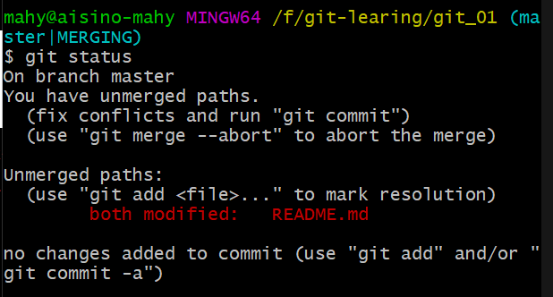
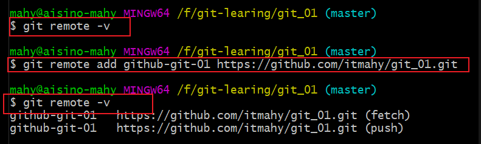
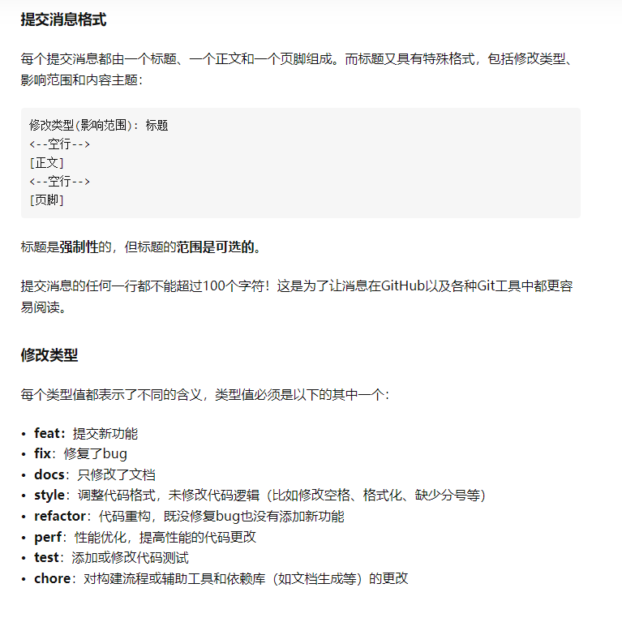

:::tip
 GIT笔记，里面包含了一些命令
:::
<!-- more -->

[[toc]]

# git命令

## 设置用户签名以及查看git版本

- git config --global user.name [username]

- git config --global user.email [email]

- git config --global --list 

  查看本地全局用户配置信息

- git config --list 

  查看此工作空间的用户配置信息

- git config user.name

- git cofnig user.email

- git --version 

  查看版本
  
- ssh-keygen -t rsa -C "mahy_yel@163.com" 

  生成密钥

### 1. 初始化仓库

- git init 

- git init [目录]

  可以通过初始化指定的目录

### 2. 添加到缓存区

- git add .

  批量添加文件到缓存区

- git add [文件名称1]  [文件名称2] ....

  指定一个或多个文件添加到缓存区
  
- git add [目录]

  添加目录到缓存区，包括子目录

### 3. 查看状态

- git status  输出详细结果

- git status -s   输出简短结果 

- git cherry -v

  查看已提交但是未推送的说明
  
- git log master ^origin/master

  查看到未传送到远程代码库的提交详情

### 4. 删除操作

- git rm 

  后面可跟参数或不跟参数，建议不要用，很危险的操作，会删除本地文件，当然，可以使用版本切换切换到删除前的版本。

- git rm -f [文件名称]

  如果删除之前修改过并且已经放到暂存区域的话，则必须要用强制删除选项 ` -f `

- git rm --cached [文件名称]

  注意：如果文件只是从工作空间添加到缓存区，是可以删除的，如果已经从缓存区提交到本地库之后，就不能删除了。
  
- git restore --staged [文件名称]

  将文件从暂存区撤出，但不会撤销文件的更改，类似于 git rm --cached [文件名称] 命令
  
- git restore  [文件名称]

  将不在暂存区的文件撤销更改，意思是撤销掉你的上次操作，恢复文件

### 5.提交到本地库

- git commit -m "提交说明信息"

- git commit 

  会打开vim编辑器，写入提交说明信息之后保存自动提交
  
- git commit -m "提交说明信息" [文件名称]

  从暂存区提交某个文件到本地库，如果是合并分支的时候，不能在后面跟文件名称，否则会报错。

- git commit -a 

  修改文件之后，不需要`git add .`，直接提交到本地库，会进入vim编辑提交信息

- git commit -am "提交说明信息" 

  修改文件之后，不需要`git add .`，直接提交到本地库，不会进入vim编辑提交信息

### 6.查看历史记录

- git reflog

  查看缩减信息

  

  HEAD -> master 说明是当前版本为 e3371c8 这个版本，并且分支为master，例如：

  

- git log 

  查看全量信息
  
- git blame [文件名称]

  以列表形式查看指定文件的历史修改记录

- git log --oneline

  查看历史记录的简洁的版本

- git log --graph

  查看历史中什么时候出现了分支、合并。以下为相同的命令，开启了拓扑图选

- git log --reverse --oneline

  逆向并简洁的显示所有日志。

- git log --auther=[作者名称]

  查找指定用户的提交日志

### 7.版本切换，穿梭

- git reset --hard [版本号]

### 8.分支操作

- git branch [分支名]

  创建分支

- git branch -r 

  查看远程所有分支

- git branch -a 

  查看远程和本地所有分支

- git branch -v  或 git branch 

  查看分支，两个命令都能查看，只不过git branch -v 可以查看详细信息

  

- git checkout [分支名]

  切换分支

- git checkout -b [分支名]

  新建并切换到新分支

- git checkout -b [分支名]  [远程连接别名]/[远程分支名]

  创建本地分支并切换到此分支，并且拉取远程分支的代码

- git branch -d [分支名]

  删除本地分支

- git branch -M [分支名]

  强制将当前分支的名称修改为 [分支名]

- git push [别名] --delete [远程分支名]

  删除远程分支

- git push origin :[远程分支名]

  删除远程分支

-  git push --set-upstream [别名] [分支名称]

  本地当前分支跟远程分支关联

- git merge [分支名]

  将指定的分支合并到当前分支上，如果文件冲突了，下面是解决方法：

  1. -查看合并分支的日志，如果冲突，在会显示具体的冲突文件，并且在分支名称后面有 MERGEING 的提示

  

  

  2. 解决冲突

     HEAD到=====这个区域是当前分支的内容，=====到 ]]]]]]]hot-fix这个区域是被合并分支的内容

     

  3. 删除标识符跟冲突的代码，使用wq保存。

  4. 保存完成之后，使用git status 查看状态

     

  5. git add .  添加到暂存区

  6. git commit -m "merge hot-fix"  注意：这个不能在后面添加文件名称，否则会报错 

  7. 合并完成。

### 9. 远程操作

- 别名

  每次使用远程仓库地址很麻烦，就可以起个别名

- git remote -v 

  查看别名

- git remote show [url]

  显示某个远程仓库的信息

- git remote add [别名]  [远程仓库地址]

  

- git push [别名] [分支名称]

  推送代码到远程仓库，这个也可以推送新建的空分支，但是后续不能直接使用`git push`推送代码，因为本地分支没有跟远程分支进行关联

- git push -u [别名] [分支名称]

  推送代码到远程仓库，这个也可以推送新建的空分支，后续可以直接使用`git push`推送代码

- git push 

  不是第一次推送代码到远程仓库，如果使用这个命令，必须要先关联远程分支 执行`git push --set-upstream [别名] [分支名称]`

- git pull [别名] [远程分支名]:[本地分支名]

- git pull origin master:brantest

  将远程主机 origin 的 master 分支拉取过来，与本地的 brantest 分支合并。如果远程分支是与当前分支合并，则冒号后面的部分可以省略。如 `git pull origin master`

- git fetch

  命令用于从远程获取代码库。这个需要单独搜索

### 10. 生成连接RSA密钥

- ssh-keygen -t rsa -C "email"

  生成的密钥存放在`C:\Users\用户名称\.ssh`目录下

### 11. git 中一些选项解释

- **-d**  --delete：删除

- **-D**  --delete --force的快捷键

- **-f**  --force：强制

- **-m**  --move：移动或重命名

- **-M**  --move --force的快捷键

- **-r**  --remote：远程

- **-a**  --all：所有

### 12. 比较文件不同

- git diff [文件名称] 

  尚未缓存的改动，显示暂存区和工作区的差异

- git diff --cached [文件名称]   或者  git diff --staged [文件名称]

  显示暂存区和上一次提交(commit)的差异:

- git diff HEAD

  查看已缓存的与未缓存的所有改动

- git diff --stat

  显示摘要而非整个 diff

### 13. 移动或者重命名文件

- git mv [旧文件名称] [新文件名称]

- git mv -f [旧文件名称] [新文件名称]

  如果新文件名已经存在，但还是要重命名它，可以使用 **-f** 参数

### 14. 标签

- git tag -a [标签名eg: v1.0]
- git tag 
- git show [标签名称] 

### 15. 提交规范

